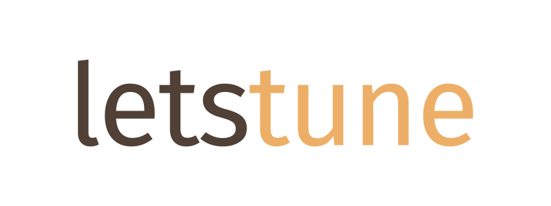

<div align="center">
  <br>
</div>

-----------------

# letstune

*Hyper-parameter tuning for the masses!*


[](https://github.com/psf/black)
[](https://pycqa.github.io/isort/)

## Why?

### Do you know good *number of layers* or *learning rate*?

**No?** I also don't. :wink:

_letstune_ tries various parameter configurations and gives you back
the best model.

### Do you have *excess* of time or cloud resources?

**Nobody has!** :alarm_clock:

When training neural network or doing gradient boosting,
_letstune_ spends most of the time on the most promising
parameters.

_letstune_ makes a kind of :moneybag: investment rounds.

At the first round, it evaluates all parameters for a few epochs.

Only 25% of trainings will advance to the next round.
Trainings with the lowest metric value are automatically dropped.

### Are you a *hard worker*?

**Neither do I.** :sunglasses:

Common tasks in _letstune_ are realized with Python one-liners:

* get the best model: `model = tuning[0].best_epoch.checkpoint.load_pickle()`
* get Pandas summary dataframe with *parameters* and *metric values*: `df = tuning.to_df()`

### Additionally:

Works with your favourite ML library :snake: - it's *library agnostic*!

*Resumes work* from the point, where program was stopped.

Permissive *business-friendly* MIT license.

## Great! How to use it?

First, define your *parameters*:

```python
import letstune
from letstune import rand

class SGDClassifierParams(letstune.ModelParams[SGDClassifier]):
    average: bool
    l1_ratio: float = rand.uniform(0, 1)
    alpha: float = rand.uniform(1e-2, 1e0, log=True)
```

Then define a *trainer*.
*Trainer* is an object, which knows how to *train* a model!

```python
class DigitsTrainer(letstune.SimpleTrainer[SGDClassifierParams]):
    metric = letstune.Metric("accuracy")

    def load_dataset(self, dataset):
        self.X_train, self.X_test, self.y_train, self.y_test = dataset

    def train(self, params):
        # params has type SGDClassifierParams

        # letstune provides method create_model
        # returning SGDClassifier
        model = params.create_model(
            loss="hinge",
            penalty="elasticnet",
            fit_intercept=True,
            random_state=42,
        )
        model.fit(self.X_train, self.y_train)

        accuracy = model.score(self.X_test, self.y_test)

        return model, {"accuracy": accuracy}


trainer = DigitsTrainer()  # new instance!
```

Neural networks and gradient boosting trainings
can be based on `letstune.EpochTrainer`,
which has `train_epoch` method.

Finally, *let's tune*!

```python
tuning = letstune.tune(
    trainer,
    16,  # number of tested random parameters
    dataset=(X_train, X_test, y_train, y_test),
    results_dir="digits_tuning",
)
```

*Our model* is ready to use:

```python
model = tuning[0].checkpoint.load_pickle()
```

Don't forget to check out [examples directory](examples)! :eyes:

## References

*A System for Massively Parallel Hyperparameter Tuning* by Li et al.;
[arXiv:1810.05934](https://arxiv.org/abs/1810.05934)

Overview of various hyperparameter-tuning algorithms.
_letstune_ implements a variant of Successive Halving.
